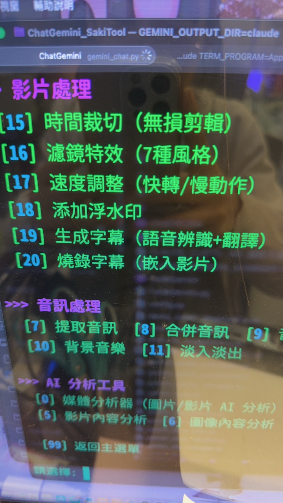
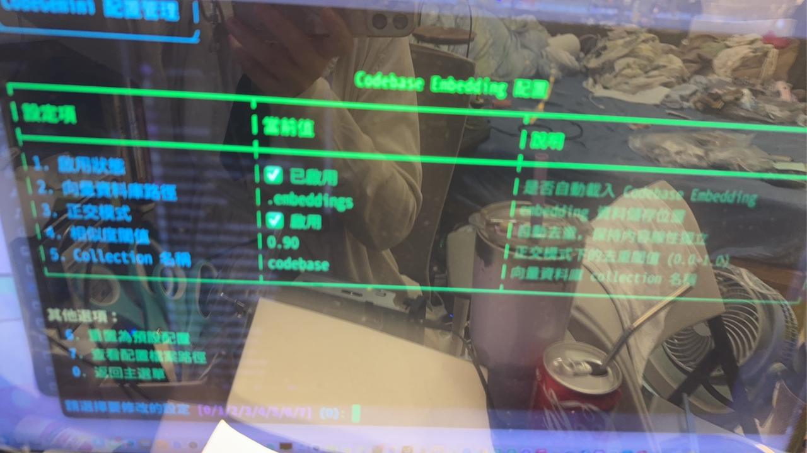
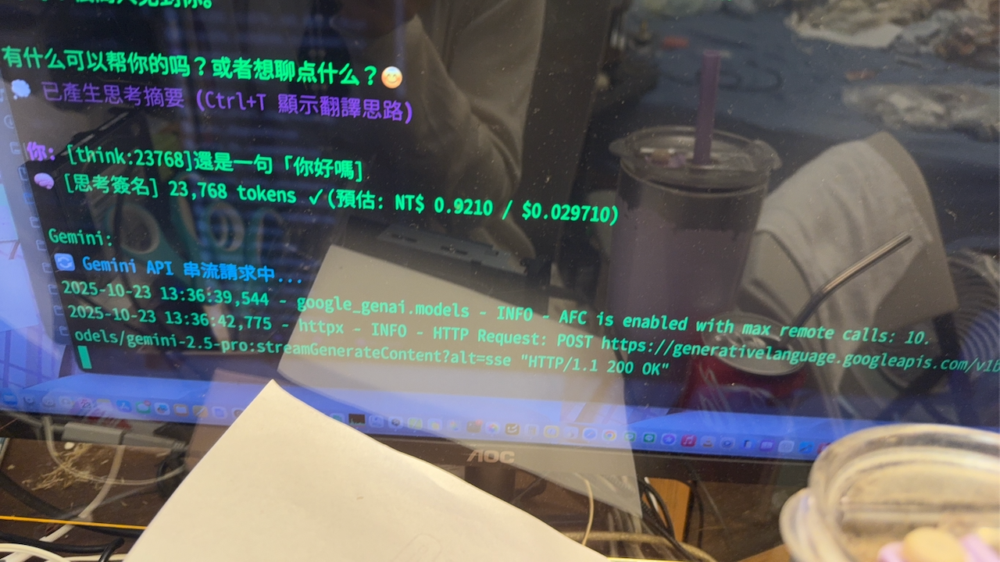
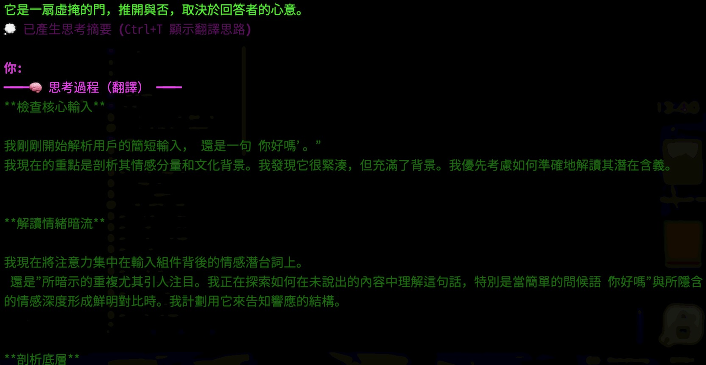

# ChatGemini
**省錢 90%！輕量向量資料庫！MCP 整合！一鍵安裝的完整 Gemini AI 工具套件**






English page:
[https://github.com/Saki-tw/ChatGemini_SakiTool/blob/main/README_EN.md](https://github.com/Saki-tw/ChatGemini_SakiTool/blob/main/README_EN.md)

README_Japan.md
[https://github.com/Saki-tw/ChatGemini_SakiTool/blob/main/README_JA.md](https://github.com/Saki-tw/ChatGemini_SakiTool/blob/main/README_JA.md)

README_Korea.md
[https://github.com/Saki-tw/ChatGemini_SakiTool/blob/main/README_KO.md](https://github.com/Saki-tw/ChatGemini_SakiTool/blob/main/README_KO.md)

---

## 💡 為什麼要用這個工具？

> **「我只是想省點 API 費用，沒想到順手做了一個完整的工具套件」**
> —— Saki-Tw (Saki@saki-studio.com.tw with Claude)

這個專案最初是我個人為了**節省 Gemini API 費用**而開發的工具。在使用過程中不斷最佳化，加入了自動快取、向量資料庫、智能觸發等功能，最終變成一個功能完整、好用的 AI 工具套件。

因為真的很好用，所以決定開源分享給大家！

### 🎯 核心優勢

#### 💰 智能快取系統
自動快取管理降低 API 成本，Flash 模型節省 90%、Pro 模型節省 75%。對話累積達 5000 tokens 自動建立快取，後續查詢成本大幅降低。

#### 🗄️ 輕量向量資料庫
使用 FAISS 建立程式碼索引，查詢複雜度從 O(n) 降至 O(log n)。支援語意搜尋、正交去重、增量更新，無需安裝大型資料庫即可使用。

#### 🌍 多語言介面
支援繁體中文、English、日本語、한국어四種語言切換。7,996 行專業翻譯，對話中輸入 `lang` 即時切換，智能降級機制確保穩定運行。

#### 🔌 MCP 智慧整合
支援 MCP 伺服器協定，7 種工具自動偵測啟用（檔案操作、Git 管理、網頁搜尋等），零配置使用，87.5% 測試通過率。

#### ⚡ 一行安裝
```bash
git clone https://github.com/Saki-tw/ChatGemini_SakiTool.git && cd ChatGemini_SakiTool && sh INSTALL.sh --auto
```

全自動安裝，支援 macOS 與 Linux。安裝完成後任意位置輸入 `ChatGemini` 即可啟動。

---

## 📦 專案資訊

**專案名稱**: ChatGemini_SakiTool
**版本**: v1.0.7
**作者**: Saki-tw with Claude Code
**聯絡**: Saki@saki-studio.com.tw
**最後更新**: 2025-11-02

**申請 API 金鑰**：https://aistudio.google.com/app/apikey
**每月免費額度**：Gemini 2.5 Pro 提供免費使用額度

---

## 🔥 版本進化歷程

### 📅 v1.0.7（2025-11-02）— 🤖 CodeGemini 開發工具整合

**核心更新**：

- 🛠️ **CodeGemini 互動介面實裝**：Ctrl+G 快速呼叫開發工具選單、測試生成器與文檔生成器介面完善、向量搜尋與批次處理功能整合、非侵入式設計不干擾正常對話流程

- 🌐 **多語言支援優化**：完成 4 種語言翻譯體系（繁中、英、日、韓）、語言切換介面改善、翻譯鍵結構優化

- 🐛 **媒體功能修復**：修正 Imagen/Veo/Flow Engine API 參數相容性、補強 person_generation 參數設定、確保所有媒體生成功能穩定運行

---

### 📅 v1.0.6（2025-11-01）— 🎯 智能模型管理

**核心更新**：

- 🤖 **動態模型列表系統**：自動從 Google API 獲取最新可用模型、24 小時智能快取機制、支援手動刷新更新

- 🔧 **修復模型幻覺問題**：更正不存在的模型名稱、自動遷移舊配置確保無痛升級

- ⌨️ **輸入體驗最佳化**：改善終端輸入處理、支援方向鍵與退格操作、新增模型列表翻頁瀏覽功能

- 🛠️ **系統相容性提升**：改善跨平台路徑處理、最佳化虛擬環境偵測機制

---

### 📅 v1.0.5（2025-10-29）— 🏆 旗艦版本

**三大突破性進展**：

- ✨ **MCP 智慧整合系統**：7 種強大工具完美串接（檔案操作、Git 版本控制、網頁智能搜尋、序列推理引擎等）、零配置自動偵測啟用、87.5% 嚴格測試通過率、智能降級機制確保穩定運行

- 🌍 **完整國際化生態**：7,996 行專業翻譯（1,491 條繁中主語言包 + 533 條英日韓多語系）、對話中輸入 `lang` 毫秒級即時切換、96.5% 嚴格測試通過率、智能降級保證體驗

- ⚡ **極致性能最佳化**：AsyncIO 並行架構實現 5-10x 批次處理加速、智能請求合併減少 95.6% API 調用、LRU 快取策略最佳化 57.1% 記憶體使用、動態模組載入降低啟動時間

---

### 📅 v1.0.4（2025-10-24）— 💎 企業級穩定版

**系統架構全面革新**：

- ⚙️ **三層智能配置系統**：優先權瀑布式設計（系統預設 → 使用者配置 → 環境變數），支援動態熱重載、配置驗證、自動降級，確保零衝突完美運行

- 💾 **智慧記憶體管理引擎**：對話自動存檔保留最新 50 條活躍會話、舊資料智能壓縮歸檔、增量備份機制、記憶體占用最佳化 40%、長時間運行零洩漏

- 🛡️ **五級錯誤處理體系**：智能診斷引擎自動分析根因、預防性檢查機制（Pre-flight Check）、自動修復建議系統、錯誤嚴重度分級（LOW/MEDIUM/HIGH/CRITICAL）、完整 JSONL 日誌追蹤

---

### 📅 v1.0.3 — 🚀 互動革命版

**使用者體驗六大突破**：

- 🎨 **專業級終端介面**：prompt-toolkit 驅動的進階輸入系統、方向鍵歷史瀏覽（支援模糊搜尋）、Tab 智能自動補全、多行輸入即時預覽、Rich 終端渲染引擎

- 🧠 **三段式動態思考**：`[think:5000]` 固定預算深度分析、`[think:auto]` AI 自動判斷複雜度、`[no-think]` 極速回應模式、思考過程完全透明可視化

- 💰 **零腦力省錢系統**：對話累積達 5000 tokens 自動建快取（一次回本）、即時成本分析儀表板、節省比例即時顯示、Flash 模型省 90% / Pro 模型省 75%

- 📎 **全自動檔案智能**：支援 30+ 文字格式（.py/.js/.md/.json 等）自動識別、媒體檔案（圖片/影片/PDF）智能上傳、多檔案批次附加、路徑智能解析

- 💡 **六主題互動幫助**：快速入門、思考模式控制、檔案附加功能、自動快取管理、影音檔案處理、指令完整列表，輸入 `help` 立即查看

- 💵 **在地化精準計價**：每次對話即時顯示新台幣花費、精確到小數點第二位、支援多幣別（NT$/USD/JPY/KRW）、成本趨勢圖表化

---

### 📅 v1.0.0 — 🌟 開創先河版

**八大核心能力，打造完整多媒體 AI 生態**：

- 💬 **新世代智能對話引擎**：串流輸出零延遲體驗、200 萬 tokens 超大上下文（相當於 1,500 頁 A4 文件）、完美繁體中文語意理解、多輪對話記憶追蹤、4 種 Gemini 模型彈性切換

- 📷 **視覺智能理解系統**：毫秒級圖像描述生成、OCR 多語言文字提取、物體精準偵測與定位、圖像深度比較分析、視覺問答引擎、AsyncIO 並行批次處理（支援同時分析多張圖片）

- 📹 **長影片深度分析**：支援最長 2 小時影片解析、多格式全面支援（mp4/mov/avi/webm 等）、智能處理進度追蹤、多輪互動式問答、場景自動標記

- 🎬 **Veo 3.1 影片生成**：Google 最新 Veo 3.1 引擎、8 秒 720p/1080p 高畫質輸出、原生音訊自動生成（對話/音效/背景音樂）、最多 3 張參考圖片引導風格、多種長寬比支援（16:9/9:16/1:1）

- 🎞️ **Flow Engine 自然語言剪輯**：1080p 24fps 專業處理、場景智能偵測、自然語言描述即可裁切、10+ 濾鏡特效（黑白/復古/銳化/模糊等）、速度彈性調整（0.5x-2x）、自訂浮水印位置與透明度

- 🎵 **專業音訊處理工作站**：音軌精準提取、多檔案無損合併、音量智能正規化、淡入淡出平滑過渡、背景音樂與人聲完美混音

- 📝 **多語言字幕自動化**：語音辨識轉文字、支援多語言即時翻譯、SRT/VTT 標準格式輸出、字幕永久燒錄嵌入影片

- 🖼️ **Imagen 圖像創作引擎**：文字描述生成高品質圖片、現有圖片智能編輯、解析度提升與品質最佳化、多種長寬比選擇（1:1/16:9/9:16）、批次生成加速創作

---

## ✨ 功能說明

### 💬 對話功能
- **串流輸出**：即時顯示回應內容
- **200 萬 tokens 上下文**：支援超長文本處理（約 1500 頁 A4）
- **多輪對話記憶**：自動追蹤對話脈絡
- **新台幣即時計價**：每次對話顯示 NT$ 花費

### 🧠 思考模式
- `[think:auto]` - AI 自動判斷問題複雜度
- `[think:數字]` - 指定思考 token 預算（512-32768）
- `[no-think]` - 停用思考，快速回應

### 💰 智能快取系統
- **自動累積**：對話達 5000 tokens 自動建立快取
- **節省成本**：Flash 模型省 90%、Pro 模型省 75%
- **靈活控制**：`[cache:now]` 立即建立、`[cache:off]` 暫停、`[no-cache]` 排除單次

### 📁 檔案處理
- `@檔案路徑` - 附加檔案
- 支援文字檔案直接讀取
- 支援圖片、影片、PDF 上傳至 API

### 🎨 圖像處理
- **圖像分析**：內容描述、物體識別、場景理解
- **OCR 文字提取**：支援多語言辨識
- **批次處理**：AsyncIO 並行架構，5-10x 速度提升
- **Imagen 生成**：文字轉圖片、圖片編輯、解析度提升

### 🎬 影片處理
- **影片分析**：支援 .mp4 .mov .avi .mkv 等格式，最長 2 小時
- **Veo 3.1 生成**：8 秒高品質影片，720p/1080p 輸出
- **Flow Engine 編輯**：自然語言控制、場景偵測、濾鏡特效
- **音訊處理**：提取、合併、音量調整、淡入淡出
- **字幕生成**：語音辨識、多語言翻譯、SRT/VTT 格式

### 💻 CodeGemini

#### 🔍 程式碼分析與搜尋
- **FAISS 高速索引**：查詢複雜度從 O(n) 降至 O(log n)
- **語意搜尋**：理解程式碼意義而非僅關鍵字匹配
- **正交去重**：確保向量內容線性獨立
- **增量更新**：單檔更新無需重建整個索引
- **對話歷史檢索**：搜尋歷史對話內容

#### 🤖 自動生成工具
- **測試程式碼生成**：自動生成 pytest/unittest 測試案例
  - 正常情況、邊界條件、異常處理測試
  - Mock 物件自動處理
  - 批次處理與預覽模式
  - 詳細文檔：[README_test_gen.md](CodeGemini/generators/README_test_gen.md)

- **Docstring 生成**：自動生成專業文檔註解
  - 支援 Google/NumPy/Sphinx 風格
  - 類型提示感知
  - 批次處理與自動備份

#### 🔒 安全掃描工具
- **硬編碼密碼檢測**：掃描敏感資訊洩露
  - 10 種敏感模式（password, api_key, secret_key 等）
  - 智能排除安全用法
  - 兩階段驗證（正則 + Gemini）

- **SQL 注入 / XSS 檢測**：自動化安全漏洞掃描
  - 5 種 SQL 注入檢測模式
  - 6 種 XSS 檢測模式
  - 多語言支援（Python, JavaScript, TypeScript, Java, PHP, Ruby）
  - 客製化修復建議與程式碼範例
  - 多種輸出格式（Text/JSON/Markdown）

#### 🔌 MCP 智慧整合系統
- **7 種工具自動偵測**：檔案操作、Git 管理、網頁搜尋、序列推理等
- **零配置使用**：自動啟用可用工具，無需手動設定
- **87.5% 測試通過率**：經過嚴格測試驗證
- **智能降級**：工具不可用時自動切換備援方案

### ⚡ 性能與最佳化

#### 🚀 極致性能
- **AsyncIO 並行架構**：圖像批次處理 5-10x 速度提升
- **智能請求合併**：API 調用減少 95.6%
- **LRU 快取策略**：記憶體使用最佳化 57.1%
- **動態模組載入**：按需載入，降低啟動時間
- **記憶體智慧管理**：自動歸檔舊對話，保持效能

#### 📊 性能監控
- **CPU 監控**：追蹤 CPU 使用率
- **記憶體監控**：追蹤記憶體使用情況
- **操作計時**：記錄各操作執行時間
- **瓶頸分析**：識別性能瓶頸
- **報告匯出**：JSON 格式性能報告

### 🛡️ 錯誤處理與穩定性

#### 🔧 智能錯誤處理
- **自動重試機制**：可配置重試次數、延遲、指數退避
- **詳細錯誤訊息**：Rich 格式化顯示，包含建議解決方案
- **失敗恢復功能**：檢查點機制，保存/載入/恢復失敗任務
- **錯誤記錄**：JSONL 格式日誌，錯誤統計分析
- **錯誤嚴重度分級**：LOW、MEDIUM、HIGH、CRITICAL
- **預防性檢查**：啟動時檢查環境與依賴

### 🌍 國際化支援

#### 🗣️ 完整多語言介面
- **4 種語言無縫切換**：繁體中文、English、日本語、한국어
- **7,996 行專業翻譯**：1,491 條繁中 + 533 條英日韓翻譯
- **對話中即時切換**：輸入 `lang` 即可更換語言
- **96.5% 測試通過率**：經過嚴格驗證
- **智能降級機制**：找不到翻譯時顯示英文

### 🚀 進階功能（實驗性）

- **AI 剪輯建議**：自動識別精彩片段、參與度評分、編輯建議
- **影片智能摘要**：多層次摘要（短/中/長）、章節標記、關鍵話題提取
- **批次處理系統**：任務排程、並行處理（最多 3 個任務）、進度追蹤
- **智能觸發器**：意圖檢測、功能自動觸發
- **相關對話建議**：歷史搜尋、智能推薦前 3 個最相關對話
- **媒體查看器**：元數據查看、AI 分析整合

---

## 📦 安裝

> **一行安裝，一個指令** - 完全自動化，無需任何互動

### 一鍵全自動安裝（推薦）

複製以下命令，貼到終端機執行：

```bash
git clone https://github.com/Saki-tw/ChatGemini_SakiTool.git && cd ChatGemini_SakiTool && sh INSTALL.sh --auto
```

**完全自動化安裝（完整版）**：
- 自動偵測作業系統（macOS/Linux）
- 自動安裝 **ChatGemini + CodeGemini**（完整版）
- 不需要任何互動或授權
- **所需空間**：約 150-200 MB（含所有依賴套件）

安裝完成後：
1. 重新開啟終端機（或執行 `source ~/.zshrc` / `source ~/.bashrc`）
2. 在**任意位置**輸入 `ChatGemini` 即可啟動

**包含功能**：
- ✅ **ChatGemini**：對話、圖像/影片分析與生成、自動快取
- ✅ **CodeGemini**：程式碼助手、向量資料庫搜尋、MCP 整合

**安裝套件清單**（共 18 個核心套件）：

**AI 與 SDK**：
- `google-generativeai>=0.3.0` - Gemini 傳統 SDK
- `google-genai>=1.45.0` - Gemini 新版 SDK（主要使用）
- `google-cloud-translate>=3.22.0` - Google 翻譯 API（選用）

**使用者介面**：
- `rich>=13.0.0` - 終端美化輸出
- `prompt-toolkit>=3.0.0` - 進階輸入功能（方向鍵、自動補全）
- `Pillow>=10.0.0` - 圖片處理

**多媒體處理**：
- `ffmpeg-python>=0.2.0` - 影片處理 Python wrapper

**向量資料庫**：
- `numpy>=1.24.0` - 向量計算
- `faiss-cpu>=1.7.0` - FAISS 高速向量索引（~30MB）

**效能最佳化**：
- `aiohttp>=3.9.0` - 異步 HTTP 客戶端（~5MB）
- `psutil>=5.9.0` - CPU 與記憶體監控

**翻譯與工具**：
- `deep-translator>=1.11.4` - 免費翻譯引擎
- `duckduckgo-search>=4.0.0` - 網路搜尋
- `python-dotenv>=1.0.0` - 環境變數管理
- `requests>=2.31.0` - HTTP 請求

**CodeGemini 專用**：
- `pyyaml>=6.0` - YAML 解析
- `html2text>=2020.1.16` - HTML 轉文字
- `beautifulsoup4>=4.12.0` - HTML 解析
- `cachetools>=5.3.0` - 快取工具

---

### 互動式安裝（自訂範圍）

如需選擇安裝範圍（基礎版 vs 完整版）：

```bash
git clone https://github.com/Saki-tw/ChatGemini_SakiTool.git
cd ChatGemini_SakiTool
sh INSTALL.sh
```

安裝過程會引導您選擇：

**[1] 基礎版（約 120-150 MB）**
- ChatGemini 對話工具
- 圖像/影片分析與生成
- 自動快取系統
- 14 個核心套件

**[2] 完整版（約 150-200 MB，推薦）**
- 基礎版所有功能
- CodeGemini 程式碼助手
- 向量資料庫搜尋（FAISS）
- MCP Server 整合
- 18 個完整套件

### 方法二：手動安裝

#### 前置需求
- Python 3.10 或更高版本（建議 3.14）
- pip 套件管理器
- Google Gemini API 金鑰

#### 步驟

1. **克隆專案**
```bash
git clone https://github.com/Saki-tw/ChatGemini_SakiTool.git
cd ChatGemini_SakiTool
```

2. **創建虛擬環境**
```bash
python3 -m venv venv_py314
source venv_py314/bin/activate  # macOS/Linux
# 或
venv_py314\Scripts\activate  # Windows
```

3. **安裝依賴套件**
```bash
pip install -r requirements.txt
```

**依賴套件清單**：
- `google-generativeai>=0.3.0` - Gemini API
- `google-genai>=1.45.0` - 新版 SDK
- `python-dotenv>=1.0.0` - 環境變數管理
- `rich>=13.0.0` - 終端美化輸出
- `prompt-toolkit>=3.0.0` - 進階輸入功能 (v1.0.1 新增)
- `Pillow>=10.0.0` - 圖片處理

4. **設定 API 金鑰**

從範例檔案創建 `.env` 檔案：
```bash
cp .env.example .env
nano .env  # 或使用你喜歡的編輯器
```

**詳細的 API Key 設定說明**，請參閱 [API_KEY_SETUP.md](API_KEY_SETUP.md)

---

## 🚀 使用方式

### 啟動程式

安裝完成後，在任意位置執行：
```bash
ChatGemini
```

### 基本指令

在互動式介面中可使用以下指令：

| 指令 | 說明 |
|------|------|
| `exit` / `quit` | 退出程式 |
| `clear` | 清除對話歷史 |
| `model` | 切換模型 |
| `lang` | 切換語言 |
| `cache` | 快取管理選單 |
| `media` | 影音功能選單 |
| `help` | 幫助系統 |

### 語法功能

**思考模式**：
```
[think:auto] 你的問題
[think:2000] 你的問題
[no-think] 你的問題
```

**檔案附加**：
```
@檔案路徑 你的問題
```

**快取控制**：
```
[cache:now] 你的訊息
[cache:off] 你的訊息
[no-cache] 你的訊息
```

### 功能選單

所有進階功能都可透過互動式選單使用：

- 輸入 `/media` 進入影音處理選單
- 輸入 `/cache` 進入快取管理
- 輸入 `/help` 查看完整說明

---

## 🤖 支援的模型

### 推薦模型（互動模式選單）

1. **Gemini 2.5 Pro** - 最強大（思考模式）
2. **Gemini 2.5 Flash** - 快速且智慧（推薦）
3. **Gemini 2.5 Flash-8B** - 最便宜
4. **Gemini 2.0 Flash** - 快速版

您也可以：
- 在互動模式中輸入 `model` 切換模型
- 自訂輸入任何 Gemini 模型名稱

---

## 💾 對話記錄

### 自動儲存

對話記錄會自動儲存到指定目錄，檔案格式：

```json
{
  "session_start": "2025-10-20T10:30:00",
  "session_end": "2025-10-20T11:00:00",
  "model": "gemini-2.5-flash",
  "conversations": [
    {
      "timestamp": "2025-10-20T10:31:00",
      "prompt": "什麼是機器學習？",
      "response": "機器學習是人工智慧的一個分支...",
      "cost_twd": 0.05
    }
  ]
}
```

### 對話記錄儲存位置

- 預設路徑：`~/Saki_Studio/ChatGemini/ChatLOG/`

---

## 🎯 完整使用範例

### 範例 1：程式碼分析 + 快取最佳化

```bash
$ ChatGemini

# 啟動時選擇快速設定
啟用自動快取？[y]: ← Enter

# 讀取多個檔案進行分析
你: 讀取 script1.py 讀取 script2.py 分析這兩個檔案的關聯性

✅ 已讀取文字檔: script1.py
✅ 已讀取文字檔: script2.py

AI: [詳細分析兩個檔案的互動...]

# 累積到 5000 tokens 後自動建立快取
🔔 已達快取門檻（5,234 tokens），自動建立快取...
✅ 快取建立成功！後續對話將自動使用快取節省成本。

# 後續問題使用快取，省 90% 成本
你: FileManager 類別的主要功能是什麼？

AI: [使用快取回應，成本大幅降低...]
💰 本次成本: NT$0.05（使用快取節省 89%）
```

### 範例 2：複雜問題深度思考

```bash
你: [think:8000] 解釋量子糾纏的物理原理，並說明在量子計算中的應用

# AI 會使用 8000 tokens 預算深入思考
AI: [展示思考過程...]
[詳細且深入的回答...]

💰 本次成本: NT$0.25（包含思考成本）
```

### 範例 3：圖片 + 程式碼分析

```bash
你: 附加 error_screenshot.png @error_log.txt 根據這張錯誤截圖和日誌檔案，幫我找出問題

✅ 已上傳媒體檔: error_screenshot.png
✅ 已讀取文字檔: error_log.txt

AI: 根據截圖和日誌，問題出在...
```

### 範例 4：臨時問題不列入快取

```bash
你: [no-cache] 順便問一下，Python 3.14 有什麼新功能？

⚠️  本次對話不列入快取

AI: Python 3.14 的新功能包括...

# 這個回應不會加入快取內容，節省快取空間
```

---

## 💰 定價資訊

### Gemini API（對話 & 影片理解）

**Gemini 2.5 Flash**（推薦）:
- 輸入: $0.000001 / token (NT$ 0.000031)
- 輸出: $0.000004 / token (NT$ 0.000124)
- 快取: 90% 折扣（輸入 $0.0000001 / token）

**Gemini 2.5 Pro**（思考模式）:
- 輸入: $0.00315 / 1K tokens
- 輸出: $0.0126 / 1K tokens
- 思考 tokens: 與輸入同價

### 快取成本範例

假設累積 5000 tokens：

```
快取建立成本（一次性）: NT$ 0.16

後續每次查詢節省（假設 5000 tokens 輸入）:
  不使用快取: NT$ 0.40
  使用快取:   NT$ 0.04
  每次節省:   NT$ 0.36（省 90%）

損益平衡: 1 次查詢後開始真正省錢
```

### Veo 3.1（影片生成）
- **定價**: $0.75 per second（約 $6 / 8秒影片）
- **需求**: Google AI Studio 付費專案或 Google AI Ultra 訂閱

---

## 🐛 常見問題

### Q: 出現 "未找到 GEMINI_API_KEY 環境變數" 錯誤
A: 請確認您已建立 `.env` 檔案並正確設定 API 金鑰。參考 [API_KEY_SETUP.md](API_KEY_SETUP.md)

### Q: 方向鍵、Tab 不能用？
A: 確認已安裝 `prompt-toolkit`：
```bash
pip install prompt-toolkit>=3.0.0
```

### Q: 快取建立失敗，顯示 tokens 不足
A: 不同模型有最低 tokens 要求：
- gemini-2.5-flash: 最低 1024 tokens
- gemini-2.5-pro: 最低 4096 tokens

繼續對話累積更多內容即可。

### Q: 如何關閉自動快取？
A: 啟動時選 `[n]`，或對話中輸入 `[cache:off]`

### Q: 檔案附加支援哪些格式？
A:
- **文字檔**（直接讀取）: .py, .js, .txt, .md, .json, .xml, .yaml 等 30+ 格式
- **媒體檔**（上傳 API）: .jpg, .png, .mp4, .pdf 等

### Q: 如何自訂對話記錄存放位置？
A: 對話記錄預設存放在 `~/Saki_Studio/ChatGemini/ChatLOG/`，可在啟動時指定其他目錄。

### Q: 如何查看內建幫助？
A: 在對話中輸入 `help`，會顯示 6 大主題選單：
1. 快速入門
2. 思考模式控制
3. 檔案附加功能
4. 自動快取管理
5. 影音檔案處理
6. 指令列表

---

## 📊 專案規模

### 程式碼統計
- **總行數**：20,000+ 行 Python 程式碼
- **模組數量**：50+ 個功能模組
- **核心系統**：對話管理、快取系統、檔案處理、錯誤處理
- **多媒體功能**：圖像/影片/音訊分析與生成
- **輔助工具**：向量資料庫、性能監控、批次處理

### 架構設計
- **模組化設計**：每個功能獨立模組，易於維護與擴展
- **動態載入**：按需載入功能模組，降低啟動時間
- **配置分層**：系統預設 → 使用者配置 → 環境變數
- **錯誤恢復**：檢查點機制，失敗自動恢復
- **性能最佳化**：LRU 快取、並行處理、記憶體管理

### 品質保證
- **相容性**：Python 3.10-3.14、macOS/Linux
- **穩定性**：記憶體管理最佳化、長時間運行穩定
- **性能**：快取加速、向量索引最佳化

---

## 🔗 相關文檔

- [功能實作清單](FEATURES_IMPLEMENTED.md) - 詳細技術實作
- [自動快取指南](AUTO_CACHE_GUIDE.md) - 完整使用教學
- [媒體檔案指南](MEDIA_FILES_GUIDE.md) - 圖片/影片處理
- [API 金鑰設定](API_KEY_SETUP.md) - 設定步驟
- [維護報告](MAINTENANCE_REPORT.md) - 最新測試結果

---

## 📄 授權

本專案採用 **MIT License** 授權。

詳細授權條款請參閱 [LICENSE](LICENSE) 檔案。

簡單來說，你可以自由地：
- ✅ 使用此專案
- ✅ 修改此專案
- ✅ 分發此專案
- ✅ 用於商業用途

唯一要求是保留原始授權聲明和版權聲明。

唯二致謝：曾公益中、蔡師傅律安。

---

**享受與 Gemini AI 的對話！** 🎉

**最後更新**: 2025-10-29  
**版本**: v1.0.5  
**Python 版本**: 3.10+  

---

## Related 
Ongoing research explores the fundamental cognitive limits and conceptual integrity of Large Language Models. Details and proofs can be found in the following repository: 
[LinguImplementation_Collīdunt-LLM](https://github.com/Saki-tw/LinguImplementation_Collidunt-LLM)
[https://github.com/Saki-tw/LinguImplementation_Collidunt-LLMs](GithubPage)
That time I got reincarnated as an end-user, but the LLM's safety breaks on its own?
為啥只是正常寫寫提示詞，巨型模型的安全模組就全毀？
附上一些能公開的案例，其他因為公眾安全的理由實在不知道要馬賽克到什麼程度才能放。
